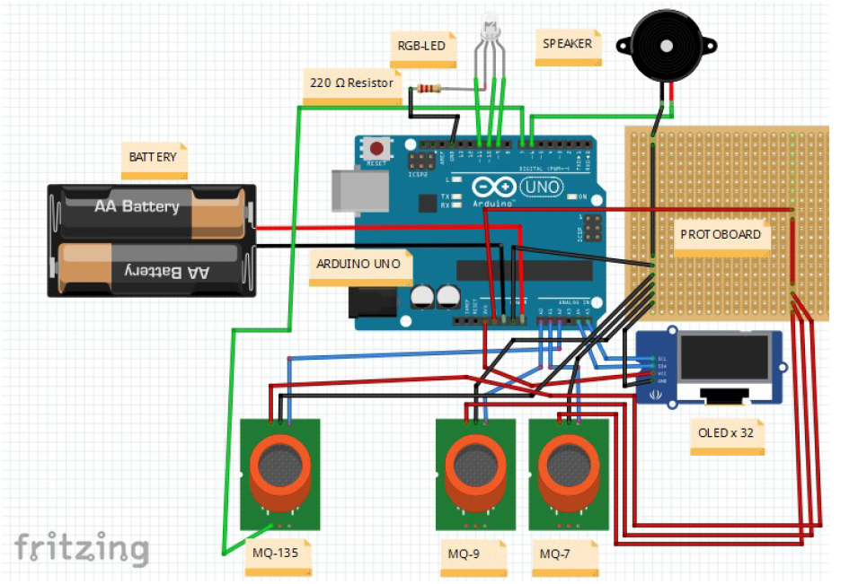

# atmosphere_detector
Arduino that is capable of carrying out a study of explosive or dangerous atmospheres.

## The aim
The main objective of this work is to define what a confined space is, gather the different regulations that affect us as sailors in this field, learn about the devices used for gas detection, and finally, design a low-cost electronic prototype to be used on non-SOLAS vessels based on Arduino Uno and Raspberry Pi 3B. Using the latter as a means to program the Arduino processor, it will also physically display the measurements during the development process and help us understand how to act in different situations. First, definitions will be established and the different regulations at the national, European, and international levels will be presented. The main gas detector models and the most prominent courses on confined spaces will be discussed. Secondly, the different electronic systems to be used will be presented, showing the assembly, programming, and calibration of the sensors. Finally, the operation of the device will be demonstrated, limitations, possible improvements, and system failures will be studied. The model will be presented as a BETA4 product, and a budget will be made for the new prototype.

## Technologies and libraries
 and Fritzing.

## Materials and wiring diagram

- MQ-7 (x1)
- MQ-9 (x1)
- MQ-135 (x1)
- LED-RGB (x1)
- OLED X 32 (x1)
- BUZZER (x1)
- RESISTOR (x1)
- JUMPERS 

